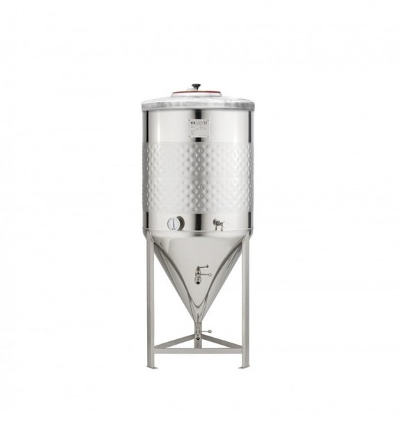
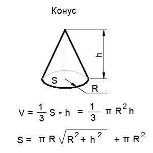
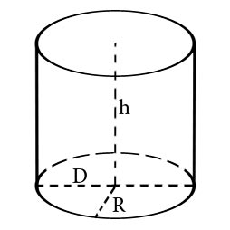

# 1.2. Masalalarning tahlili.

Yuqoridagi savollarga javob berishdan oldin bir nechta oddiy masalalarni tahlilini ko‘rib chiqaylik.

**Masala.** Rasmda keltirilgan rezervuarning hajmini geometrik o‘lchamlari asosida hisoblang. Silindr qism radiusi 1m, konus balandligi 2 m, silindr balandligi esa 3 m ga teng. Hisoblashlarni amalga oshirishda 0,01 aniqlikda yaxlitlash mumkin deb olinsin.

|  |
| ------------------------------------------------------------------------------------------------------ |
| _1.1-rasm. Rezervuarning umumiy ko‘rinishi._                                                           |

Masalani tahlil qilamiz: Bu yerda masalaning maqsadi rezervuarning hajmini aniqlashdir. Dastlab tahlil qilishda berilgan ma’lumotlar ichidan “keraksiz” axborotlarni chiqarib tashlaymiz. Bu yerda keraksiz axborotlar sifatida rezervuarning nimadan yasalganligi, tayanchlar mavjudligi yoki mavjud emasligi va rezervuarning o‘zi nima maqsadda ishlatilishini keltirish mumkin. Yechim topish yo‘nalishini tanlashda rezervuarning silindr va konus birlashmasidan iborat deb olishimiz kerak. Geometriya kursidan ma’lumki, umumiy hajm silindr va konus hajmlari yig‘indisidan iborat. Silindr va konusning hajmlarini aniqlash uchun boshlang‘ich qiymatlarni aniqlab olishimiz zarur bo‘ladi.

| a) b) |
| ---------------------------------------------------------------------------------------------------------------------------------------------------------------- |
| _1.2-rasm. Konus va silindr hajmini aniqlashda boshlang’ich qiymatlarni tahlil qilish_                                                                           |

| 
<strong>Berilgan:</strong>

hs = 3 m

hk = 2 m

R = Rs = Rk =1 m

___________________ <strong>Topish kerak:</strong>

V - ?
 | 
<strong>Formula:</strong>

 | **Yechim:**  (1).png>)\*\*\*\* |
| ----------------------------------------------------------------------------------------------------------------------------------------------------------- | --------------------------------------------------------------------------------------------------------------- | --------------------------------------------------------------- |

Yuqoridagi masalaning yechilishini tahlil qilish jarayonida, ular quyidagi bosqichlardan iborat ekanligini ko\`rish mumkin:

1. Har bir masalada avval masalaning qo‘yilishi,ya’ni masalada berilgan boshlang‘ich kattaliklar va masalaning maqsadi (topilishi kerak bo\`lgan natijaviy kattaliklar) aniqlanadi.
2. Masalani yechish uchun zarur bo\`lgan formulalar, ya’ni matematik munosabatlar hosil qilinadi.
3. Masala yechimidagi amallarni (formulalarni, munosabatlarni) bajarish ketma-ketligi aniqlanadi.
4. Natijalar olinadi va tahlil qilinadi.
