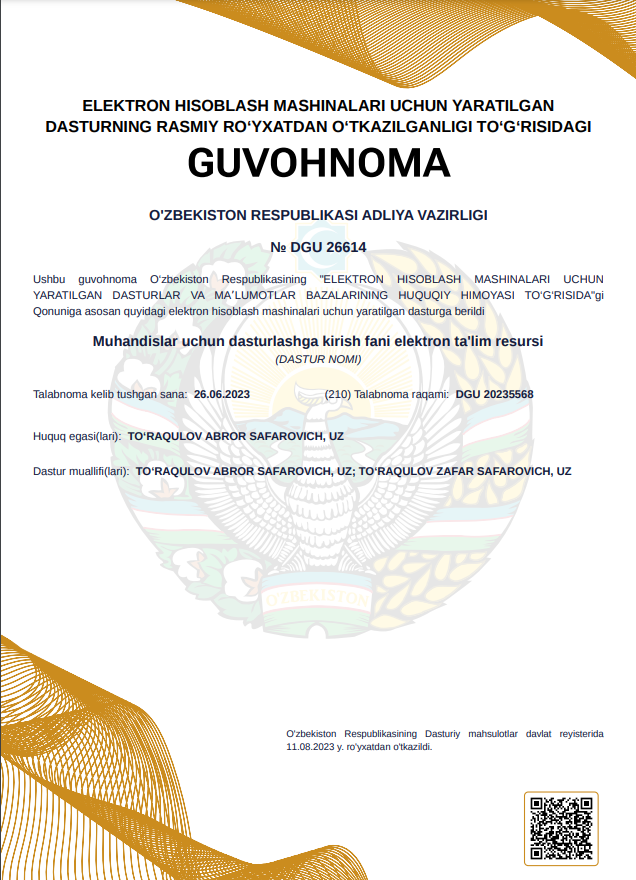

# 6.2. Tarmoqlanuvchi jarayonlarga sodda misollar

Tarmoqlanuvchi algoritmga tipik misol sifatida quyidagi sodda misolni ko’rishimiz mumkin:

6.2.1-rasm. Tarmoqlanuvchi algoritm bo’yicha masalani yechish algoritmi

Bunda, berilgan funksiya berilgan _x_ ning qiytmatiga bog‘liq holda, agar u manfiy bo‘lsa «_Yes_» tarmoq bo‘yicha _y=1/sin(x)_ funksiyaning qiymati, aks holda _y=cos(x)_ funksiyaning qiymati hisoblanadi (6.2.1-rasm).

Tarmoqlanuvchi jarayonlarda shart ishlatilishi bo’yicha bitta amaliy misolni ko’rib o’tamiz. Trubaquvurlardagi oqib o’tuvchi moddalar gidrodinamik xususiyatidan kelib chiqib bir necha xil oqimlarga tasniflanadi. Bunda oqim trubaquvur bo’ylab tartibsiz aralash harakatlansa, bu turbulent oqim, agar quvur ko’ndalang kesim yuzasiga perpendikulyar tekis harakatlansa, bu oqim laminar oqim deyiladi. Agar oqim aralash va tekis harakat navbati bilan harakatlansa, o’tish oqimi deyiladi. Ushbu ko’rsatkichlarni tavsiflash uchun miqdoriy ko’rsatkich aniqlangan bo’lib, u Reynolds sonlari (Re>4000 da turbulent, Re<2300 da laminar, oraliq holatda o’tish oqim) deb ataladi. Reynolds soni suyuqlik zichligi, tezligi va qovushqoqligi hamda trubaquvur diametriga qarab aniqlanadi.

.png>)

Ushbu misoldan ko’rinib turibdiki, oqimning turini aniqlashda Reynolds soni aniqlash kerak ekan. Keyin esa ushbu son tarmoqlanish sharti bilan solishtirilib ko’riladi. Agar shart rost qiymatga ega bo’lsa, tarmoq ichidagi hisoblashlar bajarilib, xulosa beriladi. Aks holda keyingi shart tekshiriladi.
